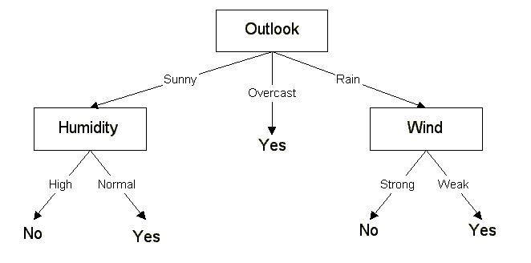

# Klasifikácia

Matej Kubinec

---

# Čo je to klasifikácia?

- Klasifikácia je proces predikcie triedy danej množiny dát.
- Triedy sú nazývané aj cieľ/značka alebo kategória.
- Patrí do skupiny učenia s učiteľom (trenovacie dáta majú známu triedu)

---

# Prečo vôbec klasifikovať dáta?

- detekcia spamu (binárna klasifikácia)
- detekcia podozrivého trafficu na sieti
- odporúčanie reklám
- ...

---

# Ako môžeme klasifikovať dáta?

1. Lazy Learners
   - Trieda je určená na základe podobnosti/blízkosti k testovacím dátam.
   - Oproti Eager Learners je náročnejší výpočet predikcie.
   - napr. k-nearest neighbor, case-based reasoning
2. Eager Learners
   - Zostrojí sa klasifikátor založený na trénovacích dátach.
   - Oproti Lazy Learners je výpočet náročnejší v trénovacej fáze.
   - napr. rozhodovacie stromy, Naive Bayes klasifikátor, neurónové siete

---

# Dáta - Golf/Weather

[zdroj](https://datacadamia.com/data_mining/weather)

| Outlook  | Temperature | Numeric Temperature | Nominal Humidity | Numeric Humidity | Nominal Windy | Play |
| -------- | ----------- | ------------------- | ---------------- | ---------------- | ------------- | ---- |
| overcast | 83          | hot                 | 86               | high             | FALSE         | yes  |
| overcast | 64          | cool                | 65               | normal           | TRUE          | yes  |
| overcast | 72          | mild                | 90               | high             | TRUE          | yes  |
| overcast | 81          | hot                 | 75               | normal           | FALSE         | yes  |
| rainy    | 70          | mild                | 96               | high             | FALSE         | yes  |
| rainy    | 68          | cool                | 80               | normal           | FALSE         | yes  |
| rainy    | 65          | cool                | 70               | normal           | TRUE          | no   |
| rainy    | 75          | mild                | 80               | normal           | FALSE         | yes  |
| rainy    | 71          | mild                | 91               | high             | TRUE          | no   |
| sunny    | 85          | hot                 | 85               | high             | FALSE         | no   |
| sunny    | 80          | hot                 | 90               | high             | TRUE          | no   |
| sunny    | 72          | mild                | 95               | high             | FALSE         | no   |
| sunny    | 69          | cool                | 70               | normal           | FALSE         | yes  |
| sunny    | 75          | mild                | 70               | normal           | TRUE          | yes  |

---

# Predspracovanie

- prevod kategoriálnych atribútov

| outlook  | outlook_overcast | outlook_rainy | outlook_sunny |
| -------- | :--------------: | :-----------: | :-----------: |
| overcast |        1         |       0       |       0       |
| overcast |        1         |       0       |       0       |
| overcast |        1         |       0       |       0       |
| overcast |        1         |       0       |       0       |
| rainy    |        0         |       1       |       0       |
| rainy    |        0         |       1       |       0       |
| rainy    |        0         |       1       |       0       |
| rainy    |        0         |       1       |       0       |
| rainy    |        0         |       1       |       0       |
| sunny    |        0         |       0       |       1       |
| sunny    |        0         |       0       |       1       |
| sunny    |        0         |       0       |       1       |
| sunny    |        0         |       0       |       1       |
| sunny    |        0         |       0       |       1       |

---

<!-- ```python
import pandas as pd

# 1. load data
data_df = pd.read_csv('data.csv', sep=';')

# 2. separete label column
play = data_df['Play']
data_df = data_df.drop('Play', 1)

# 3. preprocessing - categorical columns
cat_cols = ['Outlook', 'Temperature Nominal', 'Humidity Nominal', 'Windy']
data_df = pd.get_dummies(data_df, columns=cat_cols)
```

--- -->

# K-Nearest Neighbour

- jeden z najzákladnejších algoritmov klasifikácie
- učenie s učiteľom
- jeden parameter _k_ - počet najbližších prvkov
- rozhoduje sa len na základe trénovacích dát
- knižnice: [sklearn](https://scikit-learn.org/stable/modules/generated/sklearn.neighbors.KNeighborsClassifier.html)


---

<!-- ```python
# K-Nearest Neighbors
from sklearn.neighbors import KNeighborsClassifier

clf = KNeighborsClassifier(n_neighbors=2)
clf.fit(x_train, y_train)

clf.score(x_test, y_test)
```

--- -->

# Rozhodovacie stromy

- vetvia sa na základe atribútov
  - kategoriálne - na zaklade hodnoty (outlook = sunny)
  - numerické - väčšie/menšie ako nejaký prah (temperature > 60)
- je jasné prečo sa zaradil záznam do danej triedy
- top-down pristup
- delenie na základe zisku informácie
- vhodné pre kategoriálne dáta
- knižnice: [sklearn](https://scikit-learn.org/stable/modules/generated/sklearn.tree.DecisionTreeClassifier.html?highlight=decision%20tree#sklearn.tree.DecisionTreeClassifier)



---

<!-- ```
# Decision Tree
from sklearn.tree import DecisionTreeClassifier

clf = DecisionTreeClassifier()
clf.fit(x_train, y_train)

clf.score(x_test, y_test)
```

--- -->

# Neuronové siete

- množina prepojených neurónov
- vstupná vrsta + výstupná vrstva + skryté vrstvy
- každý vstup na neuróne má priradenú váhu
- funguje ako BlackBox, po naučení nie je možné určite na základe čoho sa rozhoduje
- vhodnejšie na číselné hodnoty
- knižnice: [tensorflow](https://www.tensorflow.org/), [keras](https://keras.io), [sklearn](https://scikit-learn.org/stable/modules/neural_networks_supervised.html)


---

<!-- ```
# Neural Networks
from sklearn.neural_network import MLPClassifier

clf = MLPClassifier(hidden_layer_sizes=(3, 5))
clf.fit(x_train, y_train)

clf.score(x_test, y_test)
```

--- -->

# Vyhodnocovanie

- rozdelenie dát na trénovaciu a testovaciu množinu
  - naučenie na trénovacej množine
  - otestovanie presnosti na testovacej
- k-fold validácia
   - dataset je rozdelený na k disjunktných podmnožín, približne rovnakej veľkosti


---   

# Otázky


---

# Ďakujem za pozornosť! 
